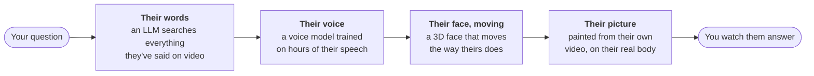

# alive

### Ask a creator anything. Watch them answer, in their own words, voice and face.

Give alive a creator's YouTube videos. It learns how they talk, how they sound and how
their face moves, and builds a live version of them you can question. Every answer is
drawn from things they actually said, with each claim tied back to the video it came from.

[**Read the guide →**](https://pavanteja295.github.io/alive/) &nbsp;·&nbsp;
[How it works](#how-it-works) &nbsp;·&nbsp; [Try it](#try-it) &nbsp;·&nbsp;
[Build your own](#build-your-own-creator) &nbsp;·&nbsp; [Built on](#built-on)

> **Everything it shows is AI-generated, and labelled that way on every frame.** The face,
> voice and words are made by models; the creator never said any of it. Ask a creator's
> permission before you build or share a model of them.

Working today for two creators: **Dr K** (HealthyGamerGG) and **Andrew Huberman**.

---

## How it works



Five models, one per box, all learned from the same public videos. The picture is a newly
drawn head placed onto real footage of the creator, so the body, hands and room are
genuine and only the face is new.

**How fast:** the answer takes 20-80 seconds to write (the LLM is most of the wait). After
that you hear them within a second, and see them speak about ten seconds later, faster
than real time. While it thinks, the creator sits there blinking and breathing, so the page
never looks frozen.

## Try it

You need a creator's trained models in `checkpoints/<creator>/` (not published yet; you
build them, below). Then:

```bash
./alive up huberman        # or drk; ready in about 20 seconds
# open http://127.0.0.1:8800 and ask a question
./alive down               # stop
```

`./alive check huberman` tells you what's missing, if anything.

## Build your own creator

One command turns a list of YouTube videos into every model:

```bash
./alive build <creator>
```

It downloads the videos, trains each model in order, and **stops whenever a person needs
to look at something**: which shots really show the creator, whether a voice clip sounds
right, whether lips and sound line up. You decide, write it down, and run the same command
again. It picks up where it left off.

About a day of computer time per creator on one GPU, most of it tracking their face. The
[guide](https://pavanteja295.github.io/alive/new-creator.html) walks through it from
nothing, with a diagram for every step.

**Rebuilding Dr K or Huberman:** every decision made while building them is recorded in
this repo, so `./alive build drk` or `./alive build huberman` replays the whole thing from
YouTube. A from-scratch rebuild of Huberman reproduced his voice to the same scores.

## What you need

| | to run it | to build a creator |
|---|---|---|
| GPU | NVIDIA, 12 GB | NVIDIA, 16 GB |
| disk | ~3 GB per creator | ~150 GB while building |
| also | Linux, an Anthropic API key | ffmpeg, yt-dlp |

Some inputs can't be shared, so you bring your own: the FLAME head model (free for
research), NVIDIA's Audio2Face-3D models, a MetaHuman face from Epic's MetaHuman Creator,
and an Anthropic API key. [Setup](https://pavanteja295.github.io/alive/setup.html) says
where to get each and where it goes.

**Not in this repo:** the trained models, and the creators' videos and words. The recipes
rebuild them from public uploads.

## Built on

The hard parts stand on published work:

- **[STAvatar](https://github.com/JiankuoZhao/STAvatar)** ([paper](https://arxiv.org/abs/2511.19854)) draws the photoreal face
- **[F5-TTS](https://github.com/SWivid/F5-TTS)** ([paper](https://arxiv.org/abs/2410.06885)) is the voice
- **[VHAP](https://github.com/ShenhanQian/VHAP)** with the [FLAME](https://flame.is.tue.mpg.de) head model tracks the face in video
- **NVIDIA Audio2Face-3D** turns speech into face movement, corrected per creator
- **Epic Games MetaHuman** and **[OpenRigLogic](https://github.com/EpicGames/OpenRigLogic)** give the 3D face its controls
- **Anthropic Claude** writes the answers

We also tried [inmystyle](https://github.com/achak1987/inmystyle) for speaking style and
dropped it; [credits](https://pavanteja295.github.io/alive/credits.html) has why, and
what was changed in each project.

## Known limits

- A hand or microphone in front of the face gets painted over by the new face.
- Huberman's lips run about 0.2 s ahead of his voice (his source video's sound is late).
- Lips don't always fully close.
- The creator's body replays real footage, so it doesn't react to what they're saying.

<details>
<summary><b>For developers: what's where</b></summary>

```
alive          start, stop, check, build
engines/
  knowledge_style/   question -> answer text        (serves on :8788)
  text2audio/        answer text -> voice           (:8791)
  audio2face/        voice -> face -> pictures      (:8730)
app/           the viewer page                      (:8800)
recipes/       how every model is built, in order, for any creator
creators/      per creator: live settings, and every recorded build decision
env/           Python environments, our patches to outside code, setup
docs/guide/    the guide (served at pavanteja295.github.io/alive)
checkpoints/   trained models       (not in git)
data/          videos and working files (not in git)
externals/     outside code at fixed commits (bash env/setup_externals.sh)
```

How the project is run: nothing in the code names a person (each creator is a settings
file), every model is built by a recipe that anyone can rerun, and progress is always read
from what's on disk, never written down by hand. `MANIFESTO.md` has the direction,
`problems.md` what's unresolved. The full folder layout and the shared face assets are in
[setup](https://pavanteja295.github.io/alive/setup.html).

</details>
