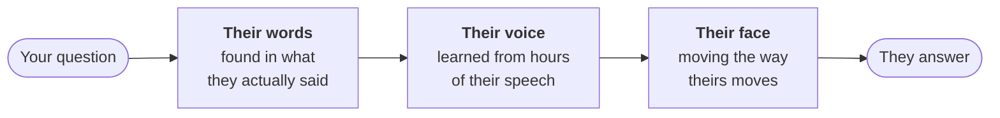

# alive

### Turn any YouTube creator into an AI clone you can talk to.

Feed it their YouTube videos. Ask it anything. Watch them answer, in their own words,
voice and face.



- **From their own words.** Answers come from their videos, and every claim points back to the moment they said it.
- **Sounds like them.** Their voice, their pace, their pitch.
- **Looks like them.** Their face, drawn fresh onto real footage of their body.
- **Any YouTube creator.** Give it their videos, get their clone. English-speaking creators for now.

> Every clone is AI-generated and labelled so. Ask a creator before you clone them.

## Requirements

| | to run a clone | to build one |
|---|---|---|
| **GPU** | NVIDIA, 12 GB | NVIDIA, 16 GB (built on an RTX 5080) |
| **RAM** | 16 GB | 32 GB |
| **Disk** | 3 GB per clone | 150 GB while building |
| **Time** | starts in 20 s | about a day per creator |

**Software:** Linux, an NVIDIA driver for CUDA 12.8, [Miniconda](https://docs.conda.io/projects/miniconda/), [uv](https://docs.astral.sh/uv/), ffmpeg, yt-dlp.

**[Claude Code](https://claude.com/claude-code):** the recipes are written for it to run. It drives the build and makes
the look-and-decide calls along the way (which shots show the creator, where they look at rest).
You can make those calls yourself, but it is the intended way to build a clone.

**Bring your own** (these can't be shared):
- an [Anthropic API key](https://console.anthropic.com), for writing the answers
- the [FLAME](https://flame.is.tue.mpg.de) head model, free for research
- NVIDIA's Audio2Face-3D models
- a MetaHuman face from Epic's MetaHuman Creator

[Setup](https://pavanteja295.github.io/alive/setup.html) walks through each one.

## Install

```bash
git clone https://github.com/pavanteja295/alive && cd alive
./alive install
```

That one command fetches the outside code (face tracker, renderer, voice model), creates
all six Python environments, and builds the shared face assets. It takes 30-60 minutes
the first time and skips whatever is already done, so rerun it any time. It ends with a
list of the files only you can supply (above); add them and run it once more.

## Make a clone

No trained clones are published. You build one from a creator's YouTube videos:

```bash
./alive build huberman     # download, train every model; about a day, mostly unattended
./alive up huberman        # start it, then open http://127.0.0.1:8800
```

`huberman` and `drk` come ready to rebuild. For anyone else, copy `creators/_template/`,
list their YouTube video ids, and build. The build stops whenever a person needs to
look at something; make the call (or let Claude Code make it) and run the same command
again.

**[Read the guide →](https://pavanteja295.github.io/alive/)** for setup, how each part
works, and how to add your own creator.

Built on [STAvatar](https://github.com/JiankuoZhao/STAvatar), [F5-TTS](https://github.com/SWivid/F5-TTS),
[VHAP](https://github.com/ShenhanQian/VHAP), NVIDIA Audio2Face-3D, Epic MetaHuman and
Anthropic Claude ([credits](https://pavanteja295.github.io/alive/credits.html)).
