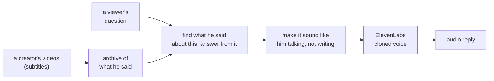
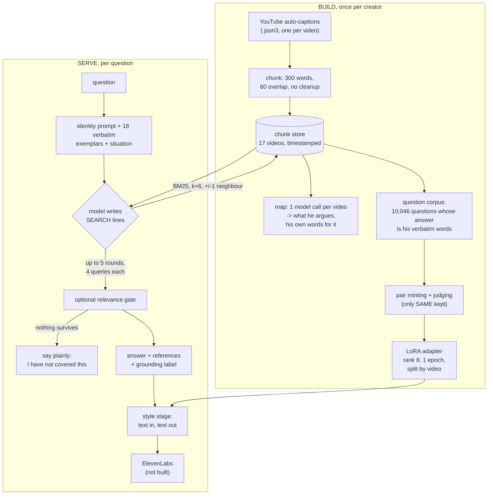
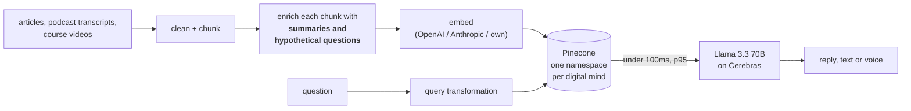
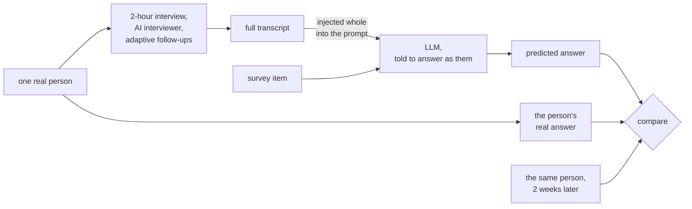
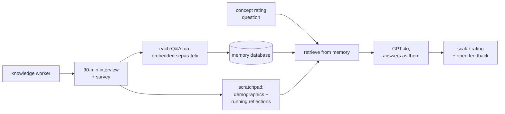
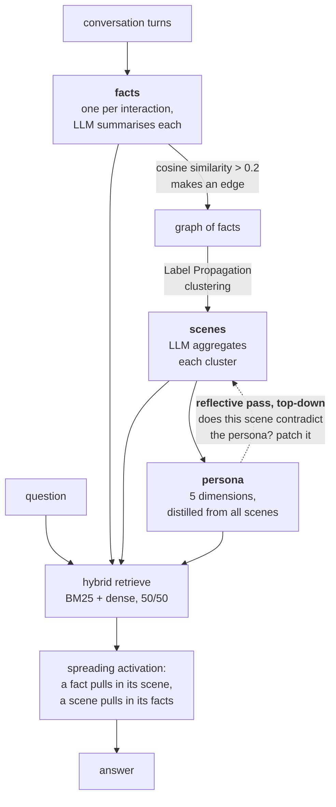
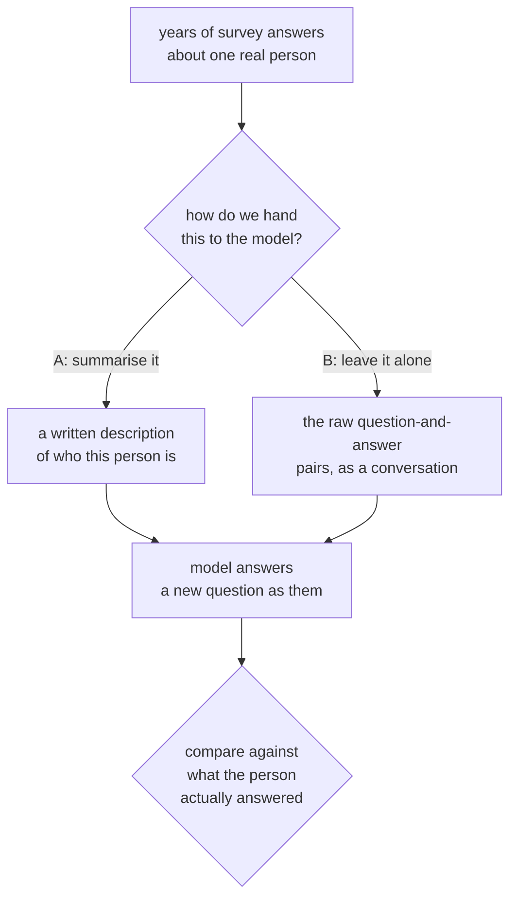
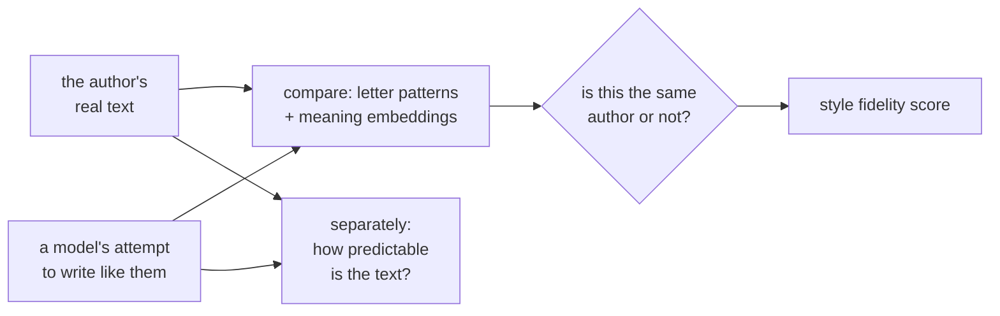

# Related work, first pass

**What this file is.** The first collected batch of outside work, read and written up so we
can position our own construction against it. It is a **triage document**: every entry gets
a relevance rating and a reading queue, and nothing here is a verdict yet.

**How it relates to the rest of `references/`.** `README.md` in this folder defines the
destination: `BASELINE.md` (what the system should be made of) and `BELLS.md` (improvements
that assume a baseline). An entry graduates out of this file into one of those **when it has
been read properly and carries a verdict against a named decision of ours**. This file is
the waiting room, and it exists so that the reading order the README demands has somewhere
to start.

Collected and written 2026-09-15. Seven entries, two added the same day. Every claim below was read off the source, not recalled.
PDFs are in `pdf/`.

---

## 1. What we are building

A **conversational clone of a creator that sounds like them talking.**

Somebody types a question. The system answers using things the creator has actually said,
in the creator's own speaking voice, and then says it out loud in their cloned voice.

The full flow we want, end to end:



Three commitments that separate this from a chatbot with a persona prompt:

1. **The answer's content comes from things he actually said**, retrieved with timestamps
   you can check, not from the base model's impression of him.
2. **Sounding like him is a separate job from knowing what he thinks**, done by a separate
   model that never sees the question.
3. **The output is written to be spoken.** Text is a waypoint, not the product.

---

## 2. Our architecture as it stands



Two properties of this shape that matter for every comparison below:

- **The archive sits beside the model, not in front of it.** The question is not routed
  through a retriever and then handed to a generator. The model decides what to search for
  and searches several times. That choice is worth +0.351 on our recall measure, against
  +0.008 for prompt wording, measured in a crossed 2x2.
- **Nothing is extracted.** We store his words. The per-video map points at videos and is
  never quoted, never cited, never substituted for the source. This is our decision K3.

Where we are weak, measured, and stated up front so the comparison is honest:

| ours | measured |
|---|---|
| word-overlap search only, no meaning-based search | 58 of 99 rejections were "no passage addresses this" for questions written from the transcripts themselves |
| single-query top-k cannot assemble an answer spread across two videos | 0 of 12 complete on a smoke test |
| the style stage does not work yet | blind judge picked the real speaker 60 of 60 |
| no metric on the style axis is settled | two of our own documents disagree, both citing reasons |

---

## 3. The collection at a glance

| # | source | what it is | relevance | why |
|---|---|---|---|---|
| A | **Delphi** (Cerebras blog, Pinecone case study, Sequoia podcast) | a company shipping our product | **5 / 5** | the only source that tells us what production looks like: the latency budget, the storage shape, and three named answering modes |
| B | **Park et al., arXiv 2411.10109** + Stanford HAI brief | 1,052 people simulated from interviews | **5 / 5** | the strongest published result on simulating a specific person, and it hands us an evaluation idea we do not have |
| C | **Wang & Siu, arXiv 2603.29890** | the negative replication | **5 / 5** | the only paper in the set that measures voice and tone, and it says nobody's agents capture it |
| D | **Bi-Mem, arXiv 2601.06490** | hierarchical memory for personalised chat | **2 / 5** | conflicts with our standing decision on storage; useful as a map of the memory-systems field and its benchmark |
| E | **open-source landscape** (Second-Me, Graphiti/Zep, Mem0, Letta, role-play family) | what you can clone today | **3 / 5** | one of them is the open shape of Delphi's storage claim; the rest tell us what is commodity and what is not |
| F | **Kinzinger & Hartmann, arXiv 2606.04592** | twins from messy pre-existing data, built many ways and compared | **5 / 5** | the only head-to-head between keeping the material raw and summarising it, and the raw side wins everywhere |
| G | **Jemama & Kumar, arXiv 2509.24930** | how well models imitate a writer, asked directly | **4 / 5** | the only paper whose whole subject is our stage B, and it separates sounding right from being detectably machine-made |
| H | **Second Me, arXiv 2503.08102** | the one open project that trains rather than searches | **2 / 5** | abandoned repo, and it scores itself with the model that wrote its own exam. Section 3.3 is worth taking |

Note before reading further: **B and the HAI policy brief are the same study.** The brief is
the policy-facing summary of 2411.10109, same lead author, same 1,052 participants, same 85%
number. Treat the brief as the governance chapter of that paper, not as an independent source.

---

## 4. A. Delphi

**What it is.** A funded company (16M Series A, Sequoia) selling exactly our product: a
creator uploads their content and gets a chatbot that answers as them, by text and by voice.
Thousands of these exist since a December 2023 beta.

**The public record is in two halves that do not obviously agree**, and that is itself the
most useful thing about it.

### Half one: the infrastructure story (Pinecone case study, VentureBeat)



Verified numbers: **100 million vectors across 12,000+ namespaces**, **20 queries per second
globally**, retrieval **under 100ms at the 95th percentile**, which is **less than 30% of a
1-second end-to-end target**. Planned capacity **5 million namespaces**. Cerebras serves
Llama 3.3 70B at a claimed 2x the tokens per second of other providers, 5 to 10x versus GPUs.

### Half two: the founder's story (Sequoia podcast, Inference newsletter)

Not vectors at all, but an **"adaptive temporal knowledge graph"**: facts stored as things
and links between them, where each link carries a **confidence weight** and the graph
**changes over time** as the person's thinking changes. Quoted: *"Knowledge graphs are great
because you can store the connections between things, and you can also store the weights of
confidence."* Framed on Ray Kurzweil's idea that a mind is a stack of pattern recognisers.
They call the whole thing the **"Clone Brain"**.

**These are probably both true**, a graph layered over a vector store, but no public source
says how they join. Worth holding as an open question rather than resolving it by guess.

### The one genuinely important disclosure: three answering modes

| mode | what it does |
|---|---|
| **strict** | only says things it was trained on that directly answer the question |
| **interpolation** | allowed to use material from the internet |
| **extrapolation** | only its own material, but asked a new question it predicts what the person **would** say |

Their example: the person never discussed AI, but their principles about handling
uncertainty transfer, so the clone reasons across. Users also get a **"leniency"** control.

### Same as us

- Retrieval over the creator's own material, not a fine-tuned model that memorised it.
- Isolation per creator is a first-class design property, not an afterthought.
- Voice is the destination, not a bonus. Their datapoint: **users whose first experience is
  voice are 5x more likely to come back.** That is the strongest available argument for the
  ElevenLabs end of our pipeline being the point, not the polish.

### Different from us

| | Delphi | us |
|---|---|---|
| matching | by meaning (embeddings) | by word overlap (BM25), and it is our measured weak spot |
| chunk contents | text **plus generated summaries and hypothetical questions** | raw text only |
| answer loop | one retrieval, then generate | model searches up to 5 rounds, 4 queries a round |
| latency | 1 second end to end | multiple model round trips; nowhere near it |
| declining | a **mode setting** the creator chooses | a relevance gate that is on or off |
| sounding like them | undisclosed, presumably prompting | a separately trained model |
| quality | no metric disclosed anywhere | a blind A/B judge that says ours fails |

### Ideas worth taking

1. **Enrich each chunk with the questions it would answer, and index those too.** This is
   the single most directly applicable idea in the whole collection. It attacks our exact
   measured failure: our search misses passages that provably answer a question because the
   question is in the asker's vocabulary and the passage is in his. **And we have already
   built the artifact.** `qcorpus.jsonl` holds 10,046 questions generated per passage, and
   we currently use them only as training data. Delphi indexes the equivalent.
2. **Strict / extrapolation as an explicit setting, not a hidden policy.** We already
   compute a `grounding` label of `direct | extended | none` on every answer. We are one
   step from making it an input the creator sets rather than an output we report.
3. **One namespace per creator, so deleting a creator is one API call.** We have two
   creators and a `work/<subject>/` convention. It will not survive twenty.
4. **Interview mode**, where the clone asks its own creator questions to fill gaps. This is
   the only proposal anywhere in the collection that addresses coverage, which our own
   register says prompting cannot fix because no signal exists for what gets asked.

### Nice, but unproven at this scale

- **The temporal knowledge graph.** Conceptually the most attractive claim in the set: it
  would let a clone represent that someone changed their mind, which pure retrieval cannot.
  But there is no public evaluation of it, no ablation, and it directly conflicts with our
  K3 decision to store verbatim and never extract. Believe the infrastructure numbers;
  treat the graph as a hypothesis.
- **1-second end to end with a multi-search agent loop.** They achieve it with one
  retrieval. We do not know that our shape can.

**Verdict:** the product baseline to beat, and the source of our production budget.
**Relevance 5 / 5.**
**Read next:** nothing academic, it is engineering. But their enrichment idea traces back to
the HyDE / hypothetical-document line in retrieval research, which is worth a proper read.

---

## 5. B. Generative Agent Simulations of 1,000 People

`arXiv 2411.10109`, Park, Zou, Kamphorst, Egan, Shaw, Hill, Cai, Morris, Liang, Willer,
Bernstein. Stanford, Northwestern, Washington, Google DeepMind. November 2024, revised
June 2026. Policy brief: Stanford HAI, May 2025, same study.

**What they did.** Recruited **1,052 Americans**, representative across age, gender, race,
region, education and politics. An AI interviewer ran a **two-hour semi-structured
interview** with each one, following the American Voices Project protocol. Then they built
one agent per person and tested whether it could answer surveys the way that person did.



**The architecture is deliberately the simplest possible thing.** No retrieval, no database,
no fine-tuning. The whole interview transcript goes into the prompt.

**Results.** Against the General Social Survey, agents hit **85% normalised accuracy**.
Personality test 80%. Economic games 66%. Demographic-only baselines managed 74%.
Interview-only, survey-only, and both combined scored 83%, 82% and 86%, so **combining
sources barely helped**, which suggests accuracy plateaus once you have enough evidence.
The interview-based agents were also **less biased across political and racial subgroups**
than demographic-based ones.

### The idea we should steal

**"85% normalised accuracy" does not mean 85% correct. It means 85% as accurate as the
person was at replicating their own answers two weeks later.** The ceiling is the person's
own inconsistency, and it is well under 100%.

This is the right shape for a metric on a task where perfect agreement is not available and
not even meaningful. We already have one instrument with that property: our blind A/B judge
targets **50%**, not 100%, because 50% means indistinguishable. We do not have the
equivalent on the content side. The question it suggests: **how consistent is the creator
with himself?** If he answers two similar questions across two videos and says slightly
different things, that spread is the real ceiling for any system answering as him, and
every content number we have should probably be divided by it.

### Same as us

- One specific real person, not a demographic type or an archetype.
- Grounded in that person's own words rather than a description of them.
- Willing to report where it fails. The economic games result (66%) is published beside the
  survey result (85%).

### Different from us

| | Park et al. | us |
|---|---|---|
| source material | a 2-hour interview, elicited on purpose | 17 videos of broadcast content, found not elicited |
| storage | none, the transcript goes in the prompt whole | chunked, indexed, retrieved |
| what is scored | forced-choice answers to standard instruments | open prose answering an arbitrary question |
| voice | not modelled, not measured | a separate trained stage |
| deployed | deliberately not released | the whole point |

**The material difference is the shape of the input.** A two-hour interview is short enough
to put in a prompt and is *about the person*. Our archive is long, and it is *about topics*,
with the person visible only as a side effect. That is why they can skip retrieval and we
cannot, and it is also why our identity questions are our worst band.

### The governance half, which the HAI brief owns

They **did not release the agents**. Research-only API access, aggregate responses open,
individual responses gated behind review. They propose an **audit log per agent** so a
participant can see what their agent is doing and **withdraw consent later**, with
permission grantable one day and revocable a month after.

For a creator product this is not an ethics footnote, it is a feature list. The creator
should be able to see what their clone said and switch it off. Delphi's namespace-per-mind
deletion is the same instinct arrived at from the compliance side.

Stated risks worth copying into our own thinking: **over-reliance when accuracy is low**,
leakage of sensitive source material, **co-option of a person's likeness**, and reputational
damage from someone manipulating the agent into saying something defamatory.

### Unproven at our scale

Whole-transcript injection works at two hours. It does not obviously work at seventeen
videos, and our own framing already rejects whole-archive context on cost and on the
evidence that long-context accuracy is not uniform across position. **But it is exactly the
day-one experiment our own documents specify and nobody has run**: frontier model, full
transcript in context, no retrieval, no training, outputs read beside his real answers. This
paper is the strongest available argument for running it, and it gives us the number to beat.

**Verdict:** the reference baseline, and the source of a metric idea we lack.
**Relevance 5 / 5.**
**Read next:** its forward citations are where the whole fidelity debate now lives (C below
is one). Inside the paper, chase its references for **fine-tuning-based agent instantiation**,
cited as the richer alternative to prompting. That is our stage B question, asked by someone
else.

---

## 6. C. Interview-Informed Generative Agents for Product Discovery

`arXiv 2603.29890`, Zichao Wang and Alexa Siu, Adobe Research, 10 March 2026.

**What they did.** Took Park et al.'s architecture and pointed it at a different task. 90-minute
workflow interviews with **51 knowledge workers**, built one agent each, then asked both the
humans and their agents to rate **four AI product concepts**, 15 questions each, for
**3,060 human responses and 3,060 simulated ones**.



Unlike Park et al., this **is** a retrieval architecture: interview turns embedded with
`text-embedding-3-small`, retrieved per question, plus a scratchpad the agent updates so it
builds a more coherent model of the participant as it goes. All components GPT-4o.

**The finding, in their words: agents are "distribution-calibrated but identity-imprecise."**

They match the population. They do not match the person.

| Wasserstein distance (lower is better) | Likert | NPS |
|---|---|---|
| human vs the same human two weeks later | **0.175** | **0.211** |
| human vs interview-based agent | 0.227 | 0.487 |
| human vs scratchpad-only agent | 0.393 | 0.513 |
| human vs no-information agent | 1.058 | 1.678 |

At the level of individuals, **every agent variant was worse than humans and none was
significantly better than any other**. Giving the agent the full interview transcript did
not reliably help at the individual level. The interview only clearly earned its keep at
the population level, and mainly by capturing **negative** responses that the other designs
flattened away.

### Why this is the most important paper in the collection for us

**They measured voice and tone, and it was the worst axis.** Quoted: *"the agents perform
the worst on the voice and tone metric, suggesting that none of the agent designs adequately
captures how the human participants are speaking."* They characterise the output as
achieving *"high-level thematic but not experiential fidelity."*

The qualitative description of the failure is almost word for word our own:

- Humans produced responses *"ranging from enthusiastic endorsement to dismissive rejection
  to philosophical tangents."* Agents produced *"uniformly constructive framing: even
  negative feedback was couched in language suggesting potential adoption given improvements."*
- Humans showed *"authentic confusion about the concept's mechanics"*, saying things like
  *"I'm a little confused on how that works."* Agents *"consistently produced clear,
  structured interpretations."*
- Humans raised specific constraints (admin approval, compliance policy, cost justification)
  that agents *"tended to flatten into generic statements."*

**That is the same phenomenon we measured from the other direction.** Our creator stammers
at 0.38 per 100 words. Every model we tried, trained or prompted, local or frontier, emits
**zero**. We ruled out model size, quantisation, adapter capacity, learning rate, checkpoint,
decoding temperature, repetition penalty, more data and more steps. Our open hypothesis is
that a loss that asks for the most likely continuation will never produce an optional
disfluency whose position is unpredictable.

This paper says the flattening is **general**, shows up in content as well as in wording,
and is not fixed by giving the model more evidence about the person. **Independent
corroboration that the thing we cannot fix is not a bug in our pipeline.**

### Same as us

- Retrieval over the person's own words, with an explicit memory and reflection step.
- Reports individual and population effects separately rather than averaging them. Our own
  working rule already forbids collapsing bands into one number; they give it a name.
- They use **chance-corrected agreement** (Gwet's AC2) rather than raw agreement, and
  **normalise against the person's own two-week repeat**. Same instinct as Park et al.

### Different from us

- Their target is a scalar rating of a hypothetical product. Ours is open prose on a topic
  the person has genuinely covered. **Ours may be the easier task**: our creator has said
  the thing, so there is a right answer in the archive. Their participants were inventing
  opinions on the spot about tools they had never used. That difference should temper how
  much of their pessimism transfers.
- They have no style stage and no style training. They measured voice, found it lacking,
  and stopped. We are trying to build the thing they found missing.

### The caution it delivers

**Do not promise individual fidelity on the strength of population-level agreement.** If we
ever report "the clone sounds like him" from an aggregate, this paper is the counterexample
sitting in the literature waiting to be cited at us.

**Verdict:** the negative control for the whole project, and corroboration for our hardest
open issue.
**Relevance 5 / 5.**
**Read next:** its related-work section is a compact map of everything negative about
persona simulation: essentialising demographic groups, consent, mis-simulated causal
reasoning, Western-norm overrepresentation. Pull those. Also pull the two fine-tuning
citations it names as the higher-fidelity alternative.

---

## 7. D. Bi-Mem: bidirectional hierarchical memory

`arXiv 2601.06490`, Mao, Tan, Liu, Liu, Xu, Ji, Wang. USTC and collaborators, 10 January 2026.

**The problem they are solving is not ours.** They assume a long-running chat between an
assistant and one user, and ask how to remember that user well enough to answer questions
about them later. We have a fixed archive of broadcast video and one creator who is not in
a conversation with anyone.

**Their argument.** Build memory bottom-up only and errors compound: a local cluster of
facts drifts away from who the person actually is, and the summary of it ends up asserting
something the person would not. So run it in both directions.



**Evaluated on LoCoMo**: 50 long dialogues, averaging 305 turns and 20 sessions each,
7,512 question-answer pairs, split into single-hop, multi-hop, temporal and open-domain.
Baselines: plain long context, plain RAG, Mem0, LightMem, A-MEM, SeCom, CAM.

**The headline numbers, on GPT-4o-mini, average F1** (a word-overlap score against the
reference answer, 0 to 100):

| method | average F1 |
|---|---|
| long context, no memory | 25.08 |
| **plain RAG** | **44.67** |
| Mem0 | 45.08 |
| CAM | 39.25 |
| **Bi-Mem** | **49.74** |

### Read that table carefully, because it is the most useful thing in the paper

**The entire memory-systems field is fighting over about five points of F1 against plain
retrieval, and the winner is still under 50.** Plain RAG at 44.67 beats several purpose-built
memory architectures. Bi-Mem's gain is real and statistically significant, and it costs an
LLM call per interaction to extract a fact, an LLM call per cluster to write a scene, five
more to distil a persona, and another per scene to calibrate it.

Second thing in that table: **multi-hop is where everyone is worst.** Bi-Mem gets 39.17 on
multi-hop against 53.68 on single-hop. Our own register says our retrieval never returns a
complete answer spread across two videos, 0 of 12 on a smoke test, and we noted the fix may
not be better ranking. **This table supports that.** Composing evidence across sessions is
hard for every system in the comparison, including the graph ones.

### Different from us, fundamentally

**They extract and discard. We store and point.** Their fact level replaces the conversation
turn with an LLM's summary of it, and everything above is built on that summary. Their
persona level is a five-dimension description of the user.

This is precisely the thing our decision K3 rejected, for two reasons that still hold:
extraction loses what it cannot recover, and a summary of what he said is not what he said,
so it cannot be spoken in his voice.

**For a style-carrying clone this is disqualifying at the top of the hierarchy.** You cannot
read a persona summary aloud as the creator. Their architecture is built for answering
questions about a person. Ours is built for answering as one.

### Ideas worth taking anyway

1. **Hybrid retrieval, BM25 and dense fused at 50/50.** They use it as the plain default.
   We are lexical-only, and our own measurements say that is a weak spot. This is the
   cheapest, least controversial upgrade in the whole collection, and unlike a knowledge
   graph it does not touch K3.
2. **The top-down consistency check.** Strip out the extraction and the idea survives: an
   aggregate built from parts should be checked against a global view, and patched where it
   contradicts. We build one aggregate per video already. Nothing checks it against anything.
3. **A fact pulls in its neighbourhood.** Our search expands to plus or minus one neighbouring
   chunk in the same video, which is the crude version of the same instinct. Theirs is
   structural rather than positional.

### New but unlikely to scale to us

- **The full three-tier build.** The cost is a model call per unit of content, several times
  over, per creator. We have 292 passages per creator and would pay it once, so it is
  affordable, but the payoff shown is 5 F1 points on a task we do not have.
- **Spreading activation.** Attractive and old (it is a classic idea from cognitive
  psychology), but the ablation they published isolates the reflective calibration, not the
  retrieval mechanism. Its separate contribution is not established in what I read.

**Verdict:** reference implementation only, conflicts with K3 at the storage level.
**Relevance 2 / 5 as a method, 4 / 5 as a map of the field.**
**Read next:** the baselines are the reading list. **Mem0**, **A-MEM**, **SeCom**, **CAM**,
**LightMem**, and **HippoRAG** are the memory-systems family. **LoCoMo** is the benchmark
they all report on, worth understanding before we ever claim a retrieval result is good.

---

## 8. E. What exists in the open

Nothing open-source does the whole job. The pieces exist separately and at very different
levels of seriousness.

### Closest to Delphi's storage claim: Graphiti / Zep

`github.com/getzep/graphiti`, Apache-2.0, ~31k stars. A **bi-temporal knowledge graph** for
agent memory: every fact carries both when it became true and when it was superseded, so a
contradicted fact is **invalidated rather than deleted** and you can query what is true now
or what was true then. Invalidation is mechanical, not an LLM asked to summarise the conflict
away. This is the open shape of the thing Delphi's founder describes and will not detail.

**Correction to a first reading: it does not belong in the extract-and-discard group.**
Episodes are retained as ground truth and every derived fact traces back to its source
episode with full provenance. That is point-don't-replace, which is our own stance, and is
materially different from Bi-Mem and Mem0, which replace the turn with a summary. Custom
entity and edge types are declared as Pydantic models.

Retrieval is hybrid — embeddings, BM25, graph traversal, and a cross-encoder rerank — at
sub-second latency. **The fourth independent source in this collection saying our
lexical-only search is behind.** Backends: Neo4j, FalkorDB, Amazon Neptune; Kuzu deprecated.

Caveat to carry: the reported gap over Mem0 on a long-memory benchmark (**71.2% vs 49%**) is
**vendor-published**, as are most numbers in this space. Mem0 publishes its own, Zep
publishes its own, and the framework that designed a leaderboard tops it. Treat every
headline in this category as a claim, not a measurement.

Operational note: Zep's self-contained community server is deprecated, so the open path is
Graphiti plus a separate graph database, which is a heavier operational shape than a library.

### Closest to our whole ambition: Second Me

The only open project that trains rather than only retrieves, which is the half of our system
nobody else attempts. Read properly it comes apart, and one part is worth taking anyway.
**It has its own entry, §11a below.**

### The memory layer, commodity

**Mem0** (extract a fact, then decide add / update / delete / do-nothing against what is
already stored, ~55k stars), **Letta/MemGPT** (memory modelled on computer architecture:
in-context core memory, searchable recall, vector archive behind a tool call), **Cognee**.
All bolt onto an existing agent. All extract.

### The role-play family, academic

**Character-LLM**, **RoleLLM**, **ChatHaruhi**, **Ditto**, **OpenCharacter**. These train
models to be a character, which is nominally our stage B. Two reasons they may not transfer:
they target fictional or historical characters where there is no ground truth to contradict,
and they are evaluated on consistency of persona rather than on being mistaken for a
specific living person. Ditto's scale is notable, 4,000 characters, ten times prior datasets.
`Neph0s/awesome-llm-role-playing-with-persona` is a maintained index of the whole area.

### The toy tier

Numerous small projects do "chat with a YouTube channel" with vector search and citations
(`ask-my-channel` is a clean example, Postgres with pgvector, free-tier embeddings). Useful
only as confirmation that the retrieval half of our stage A is commodity, and that our
actual differentiator is the parts nobody has built.

**Verdict:** Graphiti is the one to evaluate if the temporal question ever becomes live.
Second-Me is the one to read. The rest is background.
**Relevance 3 / 5.**

---

## 9. F. Synthetic Personalities: twins built from data a firm already has

`arXiv 2606.04592`, Leonard Kinzinger and Jochen Hartmann, TU Munich, 3 June 2026.

**The setup.** Everyone else in this collection builds a twin from material collected *in
order to* build a twin: a two-hour interview, a purpose-designed survey. These authors point
out that no company has that. What companies have is years of accumulated, uneven, messy
records that were gathered for other reasons. So they built twins from a long-running German
household panel survey that was never designed for this, and asked whether the twins are any
good.

They then did something the rest of the collection does not: instead of building one system
and reporting how well it did, **they built the same twin many different ways and compared
the ways against each other.** Three open-weight models, five amounts of information about
the person, two ways of handing that information to the model, and two settings for whether
the model is allowed to think before answering. Every combination, scored on the same
held-out questions from the same people.



### The result that matters to us

**Leaving the material raw beat summarising it. In every single combination they tried.**

Not on average, not mostly. Every model, with thinking and without, at full information
depth: handing the model the person's actual past answers, verbatim, as a back-and-forth,
beat handing it a well-written description distilled from those same answers.

And they say plainly why. The summarisation step is good prose, but compressing a scale
answer into a sentence **collapses a precise value into an approximate description**. Their
own example: a person picked the lowest of six options, "does not apply at all", and the
summary rendered that as a soft "she does not really...". The summary is fluent, shorter,
cheaper, and it has quietly destroyed the thing the twin needed.

**This is the strongest evidence anywhere in the collection for our decision to store his
words and never extract from them.** It is a direct head-to-head between the two options,
which nobody else in this batch runs, and the raw side wins outright. Bi-Mem builds its
entire hierarchy on the assumption that the extracted version is the useful one; this paper
tests that assumption and finds against it.

The mechanism they name is also ours, arrived at independently. We say a summary of what he
said cannot be spoken in his voice. They say a summary of what she answered cannot reproduce
her answer. Same loss, two different consequences of it.

### Two other findings worth holding

- **The raw version costs several times more tokens**, which is the honest trade and the
  reason people reach for summaries in the first place. Our chunking-plus-retrieval shape
  is a third option neither of them tested: keep it raw, but only fetch the part you need.
- **More information about the person helps, but flattens out well before you have used all
  of it.** They locate a sweet spot where most of the benefit has arrived and the rest costs
  a lot for a little. Worth knowing before we assume more videos is automatically better.
- **Letting the model think first sharpened who-is-more-like-whom without making individual
  answers more accurate.** A useful warning: extra reasoning can improve a ranking without
  improving any single output.

### Where it does not transfer

Their task is predicting which box a person ticks. Ours is producing prose in that person's
voice. A twin that picks the right survey option has not demonstrated it can say anything.
And their "raw" is still curated question-and-answer pairs, not seventeen hours of someone
talking about other things.

They also land near the same ceiling as everyone else in the collection. The best
configuration they found is a long way from replicating a person.

**Verdict:** adopt as supporting evidence for our storage decision. It does not change the
architecture; it defends one we already made, against the one paper here that assumes the
opposite.
**Relevance 5 / 5.**
**Read next:** it names the twin-building datasets the field now shares, and the trial-by-trial
behavioural batteries used to fine-tune cognition models. Those are the closest thing to a
standard corpus for this problem.

---

## 10. G. How well do LLMs imitate human writing style?

`arXiv 2509.24930`, Rebira Jemama and Rajesh Kumar, Bucknell University, 29 September 2025.
Published at a small IEEE conference.

**The first paper in the collection whose entire subject is our stage B.** Not "does it know
what the person thinks" but "does it write like them", asked directly.

They build a cheap detector of whether two pieces of text share an author, using old-fashioned
letter-pattern counting combined with modern meaning-based embeddings, and deciding by where
a pair falls relative to the spread of known same-author and different-author pairs. No
training, no threshold to tune. Then they use it to score five models trying to imitate an
author under four different prompting setups.



### Three findings, in descending order of importance to us

**1. How you ask matters far more than which model you use.**

Describing the style to the model in words achieved almost nothing, across all five models.
Showing it one real sample of the author's writing transformed the result. Showing it two
long samples was better again. And best of all was not asking at all: give the model the
first half of something the author actually wrote and let it carry on. Under that setup the
detector essentially could not tell the continuation from the original.

The largest model tested was not the best. A much smaller one matched or beat it. This is
the same shape as our own finding that prompt wording bought us almost nothing on retrieval
while the retrieval strategy bought a lot: **the lever is the setup, not the size.**

It is also directly actionable. Our style stage is a trained rewriter, paragraph in,
paragraph out. The strongest baseline in this paper is something we have not tried:
establish the voice with real samples and continue rather than instruct.

**2. Sounding like the person and being obviously machine-written are separate problems.**

This is their headline and it is the most important sentence in the collection for us.

Even when their detector was fully convinced the imitation was the real author, the text was
still **about half as unpredictable as human writing.** Human text is lumpy: it takes odd
turns, it is uneven, it surprises. Machine text imitating it is smooth, even when every
surface habit of the author has been copied. And crucially, **none of the four prompting
setups changed this.** Better imitation did not make the output less predictable.

**That is our zero-disfluency finding, measured from a completely different direction, on a
completely different task, in writing rather than speech.** Our creator breaks off
mid-sentence and restarts; every model we tried, trained or prompted, local or frontier,
produced none of that. We had ruled out model size, compression, adapter size, learning rate,
checkpoint, decoding temperature, repetition penalty, more data and more steps, and were left
with an untested hypothesis: a model trained to produce the most likely next word will never
produce the unpredictable bit, because the unpredictable bit is by definition not the most
likely.

This paper measures exactly that gap, calls it out as a separate axis from style fidelity,
and shows it does not close as fidelity improves. **It moves our hypothesis from plausible
to supported by outside evidence.**

**3. Same person, different setting, reads as a different person.**

Their detector broke down in a specific and telling way when it compared an author's formal
writing against their casual writing. Same human, and it repeatedly called them strangers.
The authors name this as the limiting factor for real deployment.

This is our situation by construction. Our targets are automatic transcripts of someone
performing to a camera. Our inputs are a model's tidy prose. That is a register gap before
any style question is asked, and this paper says register gaps defeat exactly the class of
measurement we are arguing about.

### The large caveat, and it is ours to notice

**Their detector is the same kind of instrument our own work already caught being wrong.**

It scores by letter patterns and embeddings. We measured a letter-pattern-based style score
giving a flawless result to an output that was one word repeated fifty times, because
repeating the creator's filler is maximally his pattern. Our blind judge, reading actual
text, caught what the pattern score could not.

This paper has no human judge anywhere in it. So its striking result, that continuation
produces text the detector cannot distinguish from the author, should be read as **the
detector cannot tell**, which is not the same claim as a person cannot tell. Their own
predictability finding is arguably the evidence that something is still off, which makes the
paper quietly self-undermining in a useful way.

It is also written work, not speech, at a minor venue, and one author is a high-school
student. Take the ideas; do not take it as a settled instrument.

### What it does for our unresolved metric question

Our two internal documents disagree about what to measure style with: one says use the
neural authorship models everyone publishes against, the other says those do not survive
speech and topic control, and prefers counting concrete habits.

This paper lands on the second side, offers a cheap training-free protocol, and adds a third
axis neither of ours has: **predictability, measured independently of style fidelity.**

That third axis is genuinely new to us and it is not gameable the way the others are. A
degenerate output that repeats one word is maximally predictable, so it would be caught
rather than rewarded. Worth a serious look as a companion instrument.

It does not settle the argument. It is written English, evaluated by machine only, with no
check against anyone's judgement. But it is the first candidate in the collection that is
cheap enough to run per experiment, which is its own kind of qualification given that our
current style measurement is slow enough to foreclose a search.

**Verdict:** the closest paper to our stage B, and the source of a new measurement axis.
Read properly before the style metric question is settled.
**Relevance 4 / 5.** Held below five by the venue and by the absence of any human check.
**Read next:** its own comparison of style analysis against machine-text detection is the
seam to pull. The detection literature has spent years on the predictability question and
we have not looked at it at all.

---

## 11. What the collection says as a set

Five findings that only appear when you put them side by side.

### 1. Nobody has solved sounding like the person, and only two sources even measured it

Delphi does not disclose how it handles voice. Park et al. do not model it, because
forced-choice survey answers have no voice. Bi-Mem does not touch it. Kinzinger and Hartmann
do not either, for the same reason. The role-play literature evaluates persona consistency,
not identity.

Two measured it, and both came back negative:

- **Wang and Siu** found voice and tone was their **worst** axis, across every agent design
  they tried, and described the failure as flattening: their humans ranged from enthusiasm to
  dismissal to tangents, their agents were uniformly constructive and clear.
- **Jemama and Kumar** got imitation good enough to fool their own detector, and then showed
  the output was still **about half as unpredictable as human writing**, with no prompting
  strategy closing that gap.

So the state of the art on the thing our product is named after is two negative results from
opposite directions, and they agree: **the surface can be copied and something underneath
still does not come across.** That is the opportunity, and it is why our metric problem has
no off-the-shelf answer. We are not failing to find the standard instrument. There is not one.

### 2. Everyone who measures honestly normalises against the person's own inconsistency

Park et al.: 85% **of the person's own two-week test-retest consistency**.
Wang and Siu: human-versus-same-human-two-weeks-later reported as the ceiling row in their
own results table.

Both refuse to treat 100% as the target, because a person does not hit 100% against
themselves. We already do this on one axis: our blind style judge targets 50%, not 100%.
**We do not do it anywhere on the content side**, and we have no idea what the creator's own
self-consistency is. Every content number we report is currently against an unreachable
ceiling.

### 3. The extraction question splits the field, and one paper now settles it in our favour

Bi-Mem extracts facts and builds a persona summary. Mem0 extracts. Letta extracts. Delphi's
founder describes a knowledge graph, which is extraction. Park et al. dodge it by using no
storage at all. Almost everyone assumes the distilled version is the useful one.

**Kinzinger and Hartmann actually tested it, and the raw material won in every single
configuration.** Not narrowly and not on average: every model, every reasoning setting.
The reason they give is the reason we gave: compressing an answer into good prose quietly
replaces a precise thing with an approximate one, and you cannot get the precise thing back.

That changes the status of our storage decision. It was a position we argued for from a
consequence nobody else has to care about, that **a summary cannot be spoken in the person's
voice.** It now also has outside evidence behind it on a task where voice is irrelevant,
which is a stronger place to stand. If we ever loosen it, this is the paper that has to be
answered.

Delphi's chunk enrichment is the compatible middle: derived text added so the source can be
found, never replacing the source. Worth having explicitly rather than by accident.

### 4. Composing evidence across sources is unsolved everywhere

Our register says single-query top-k never returns a complete multi-passage answer, 0 of 12.
Bi-Mem's table shows multi-hop at 39.17 against single-hop 53.68, for the best system in a
field of seven purpose-built memory architectures.

**This is not a defect of our retriever.** It is where the field is. It moves the question
from "fix our ranking" to "what shape of system assembles composed evidence at all", and
that is a literature question, not a tuning question.

### 5. Production is a one-second budget and we are not built for it

Delphi: sub-100ms retrieval at p95, less than 30% of a 1-second end-to-end target, 20 QPS,
serving a 70B model on specialist hardware to hit it.

Our stage A makes up to five sequential model calls to decide what to search for, plus a
final generation call, plus optionally a relevance-gate call, and then hands off to a local
style model, and then to a voice API. **This is a research loop, not a serving path**, and
the gap is not a tuning matter. It should be stated as a known property rather than
discovered later.

The cheerful version of the same point: **voice is worth building toward.** Delphi's
retention datapoint (5x for voice-first users) is the strongest evidence in the collection
that the ElevenLabs end of our diagram is the product rather than the garnish.

### 6. Predictability is a separate axis, and nobody here was looking for it

It falls out of Jemama and Kumar sideways. They set out to measure whether imitation works,
found that it does by their own instrument, and noticed on the way that the output stayed
markedly smoother and more predictable than the human writing it was copying, no matter how
good the imitation got.

Set that beside Wang and Siu's flattening, and beside our own creator stammering while every
model we have tried produces none of it, and the three are plausibly one phenomenon seen
three ways. **A model asked for the most likely continuation will not produce the parts of a
person that were not likely.**

If that holds, it has a consequence for how we work: it is not a defect to be fixed by better
data, a bigger base or a longer run, all of which we have already ruled out by measurement.
It is a property of the objective. And it suggests an instrument we do not have, one that is
cheap, does not need a human, and cannot be gamed by degenerate repetition the way our
current style scores can.

---

## 12. Where we actually sit

| axis | field's position | ours | who is ahead |
|---|---|---|---|
| storage | mostly extract; the one paper that tested it found raw wins | keep verbatim, point at it | **ours**, and now with outside evidence rather than only an argument |
| retrieval | dense or hybrid, one shot | lexical only, multi-query agent loop | **theirs** on matching, **ours** on query strategy |
| composing across sources | unsolved, ~39 F1 multi-hop | unsolved, 0 of 12 | nobody |
| answering as the person | prompting, undisclosed, or nothing | a separately trained stage | **ours**, and it currently fails |
| measuring voice | two negative results total | a blind A/B judge that works, and a contested substrate | **ours**, unusually |
| how to elicit a voice | showing real samples beats describing the style, by a wide margin; continuing a real passage beats both | a trained rewriter that instructs rather than continues | **theirs**, and we have not tried their best setup |
| predictability as its own axis | measured once, incidentally | not measured at all | **theirs** |
| normalising the metric | against the person's own consistency | only on the style axis | **theirs** |
| latency | 1 second, demonstrated | many round trips | **theirs**, by a lot |
| governance | audit logs, withdrawal, deliberate non-release | nothing yet | **theirs** |

**The honest summary:** our retrieval is behind, our engineering is behind, our governance
does not exist, and the two things nobody else is doing are the two things we are doing,
one of which does not work yet.

---

## 13. What this implies for the register

**Not written to `problems.md`. A person decides what is real.** These are the candidates
this reading produced.

| would touch | what the reading adds |
|---|---|
| retrieval misses material it was generated from | Delphi indexes generated questions alongside chunks. We have generated 10,046 and use them only for training. Candidate: index them |
| BM25 never returns a complete multi-passage answer | Bi-Mem's multi-hop numbers say this is the field's state, not our defect. The entry's framing should change from "our ranking" to "this shape of retrieval" |
| no model emits disfluency | Wang and Siu independently measure the same flattening, in content as well as wording, and it is their worst axis. Strengthens the elimination record |
| which style metric substrate | no paper in this batch resolves it, and now we know why: only one measured voice at all. The conflict cannot be closed from this collection |
| no paper has been read | five now have been, with verdicts. This file is the start of the reading pass, not the end of it |
| storing verbatim rather than extracting | was settled by argument; now has a head-to-head result behind it from outside. The entry should carry that, because it is what a future challenge has to answer |
| **new** | we have never tried the setup that worked best for eliciting a voice elsewhere: establish it with real samples and continue, rather than instruct a rewrite |
| **new** | predictability is a candidate instrument. Cheap, needs no human, and a degenerate repeating output fails it rather than scoring well, which is the exact failure our current style scores have |
| **new** | we do not know the creator's own self-consistency, and every content number is normalised against an unreachable ceiling |
| **new** | there is no serving-latency budget anywhere in our system, and the one public benchmark is 1 second end to end |
| **new** | no consent, audit or revocation story exists, and both serious sources in the collection treat it as part of the architecture |

---

## 14. Reading queue

In order of what unblocks the most.

| priority | what | why |
|---|---|---|
| 1 | **2411.10109 in full**, method and appendix | the reference baseline, and the normalisation idea needs the details |
| 2 | **2603.29890 related work**, and the two fine-tuning citations it names | the negative-results map, plus the only pointer to training-based persona fidelity |
| 3 | **2509.24930 in full**, and the machine-text detection literature it points at | the only paper on our stage B, and the predictability axis is new to us |
| 4 | **HyDE and the hypothetical-question retrieval line** | what Delphi's enrichment idea rests on, against our measured retrieval gap |
| 5 | the **shared twin-building datasets** named in 2606.04592 | the closest thing to a standard corpus for this problem, and we have none |
| 6 | **LoCoMo, and Mem0 / A-MEM / SeCom / CAM / HippoRAG** | the benchmark and family every memory claim is scored on |
| 7 | **Second-Me**, `2406.18312` and `2503.08102` | the only open project that trains rather than only retrieves |
| 8 | **Graphiti / Zep** | only if the "he changed his mind" question becomes live |
| 9 | role-play family, via `awesome-llm-role-playing-with-persona` | background; likely does not transfer to a living person |

**Not in the queue and deliberately so:** more Delphi coverage. The public record is
exhausted, it is two incompatible halves, and further press will not resolve them.

---

## Sources

- Cerebras, *Breaking the Boundaries of Presence: Delphi's Digital Mind Technology*
- Pinecone, *Fast, Accurate Retrieval for Creators at Scale: Delphi's Path Toward a Million Conversational Agents*
- VentureBeat, *How AI "digital minds" startup Delphi stopped drowning in user data and scaled up with Pinecone*
- Sequoia Capital, *Training Data* podcast with Dara Ladjevardian; Inference by Sequoia newsletter
- Park et al., *Generative Agent Simulations of 1,000 People*, arXiv 2411.10109 — `pdf/`
- Stanford HAI, *Simulating Human Behavior with AI Agents*, policy brief, May 2025 — `pdf/`
- Wang and Siu, *Interview-Informed Generative Agents for Product Discovery*, arXiv 2603.29890 — `pdf/`
- Mao et al., *Bi-Mem*, arXiv 2601.06490 — `pdf/`
- Kinzinger and Hartmann, *Synthetic Personalities: How Well Can LLMs Mimic Individual Respondents Using Socio-Economic Microdata?*, arXiv 2606.04592 — `pdf/`
- Jemama and Kumar, *How Well Do LLMs Imitate Human Writing Style?*, arXiv 2509.24930, IEEE UEMCON 2025 — `pdf/`
- Wei et al., *AI-native Memory 2.0: Second Me*, arXiv 2503.08102 — `pdf/`; `github.com/mindverse/Second-Me`
- `github.com/getzep/graphiti`; Mem0, Letta documentation and comparisons
- Microsoft *Speech Synthesis Markup Language* reference; ElevenLabs docs on pauses, SSML support and audio tags

---

## 11a. H. Second Me

`arXiv 2503.08102`, Wei, Ying, Gao, Bao, Tao, Shang. Mindverse.ai and UC San Diego, March
2025. Code Apache-2.0, `github.com/mindverse/Second-Me`, ~15.7k stars.

A personal assistant that represents you to other software: answering from your history,
prefilling what you would have said, critiquing what an external agent returns. Three memory
layers — L0 raw (plain RAG), L1 natural-language summaries, L2 "memories that do not
necessarily require natural language", i.e. parameterised into weights. Base model
Qwen2.5-7B-Instruct with PEFT, **SFT then DPO**.

### Why not to adopt it

| | |
|---|---|
| **abandoned** | last code commit 2025-05-13, one README edit 2025-09-19, nothing since. 143 open issues. 15.7k stars is launch attention, not use |
| **circular evaluation** | Appendix B: test data "follows the process of question generation, Weak/Multi-step/Strong COT data synthesis and data filtering" — the same pipeline as training, isolated from the train set but manufactured identically. Appendix C: scored by an LLM against a 0/0.5/1 rubric. Nothing touches ground truth |
| **admitted length bias, visible in their own example** | §3.6: "the evaluation model favors longer responses, particularly in metrics like Completeness and Empathy." Figure 5's winning output is markedly longer and more jargon-dense than the one it beats. Same shape as our N3/N8 |
| **§4 is a pitch** | claims human+AI nodes raise network efficiency "by 3 to 5 orders of magnitude", unsourced, and proposes "an NFT-based framework for personal cognitive assets" |
| **saturated** | human check at 0.95 and "close to 1". Pinned at the ceiling, so by our own `METRICS.md` rule it cannot distinguish "barely moved" from "did not move" |
| **n = 1, an employee** | stated in Appendix B: results are those of "an internal staff member who has agreed to make their test results public", 132 notes and 62 todos. 240 test items (60 first-person + 60 third-person Memory QA, 60 context enhance, 60 context critic), one person |
| **no external baseline** | Tables 1 and 2 compare their own variants only. Nothing against a plain model or retrieval alone |
| **argues its own metric is too harsh** | "human case studies suggest SECOND ME's true effectiveness may surpass reported metrics" |
| **extraction at the top** | L1 summaries, L2 weights. Same shape as Bi-Mem, cuts against K3, which now has `2606.04592` behind it |
| **wrong task** | no style evaluation anywhere, no voice. It represents you to software, not to a listener |

Reported: Table 2, Strong CoT, DPO vs no DPO — Memory (Self) 0.96/0.91, Memory (Third-party)
0.76/0.71, Context Enhance 0.85/0.75, Context Critic 0.86/0.85.

### The exception

**They trained on preferences, not only on examples, and it helped on every reported metric.**
Preference pairs were ~20% of the SFT data.

DPO is **not** next-token cross-entropy, so it does not carry the property that deletes an
optional unpredictable token — the property that survived every elimination in N16, and the
route `GOLD_STANDARD.md` Direction 2 independently names. Their base family and fine-tuning
method are ours. **The shape of the recipe transfers even though none of the results do.**

**Verdict:** read §3.3 (how preference pairs are built from one person's own data). Skip the
rest, do not build on the code. Carry the caveat that the improvement is measured on the
circular score, so this is evidence the pipeline is buildable, not that it works.
**Relevance 2 / 5** overall; §3.3 alone is a 4.
**Downgraded** from §8's earlier "worth a proper look".

Credit where due: §5 states it plainly — "large-scale evaluation is constrained by limited
real-world user feedback". Read front to back including appendices, 2026-09-15.

---

## 15. The stages, and the questions open against them

A first cut at stages that can be argued about separately. **Not qualified** — a stage is real
only when breaking it moves an instrument that points back at it, and that test has not run.

```
BUILD, once per creator          SERVE, per question
  1  cut into chunks               A  one model, one loop:
  2  describe each video                persona + passages + search + write
  3  choose the passages          B  restyle to sound spoken
  4  mint the training data       C  voice
```

**The correction the attempt produced.** What feels like three stages — holding the persona,
searching, writing — is one. They share a prompt and happen in the same calls, with no
artifact passing between them, so none can be measured or swapped alone. That is a finding
about the seams being too coarse, not a tidying-up. The two genuinely missing from the first
sketch were the voice and the offline build of the training data.

### Two discrepancies found while checking

- **The per-video description is dead at serve time.** `serve.py` never passes `use_map`, and
  the decline path that would use it sits inside the `gate` branch, which the server also
  never enables. One model call per video to build, unused in deployment.
- **The ledger is stale about the exemplars.** `work/healthygamer/ledger.md` records them as
  auto-picked and curation as untested. `exemplars.json` says 18, `curated: true`, and
  `arms/runs_curated18.json` exists. Status written down, then overtaken.

### The questions, and whether the reading answers them

| question | status | where it stands |
|---|---|---|
| why fixed overlapping chunks | **answered** | no hypothesis of ours; taken from a paper finding fixed beat semantic on retrieval, evidence and generation. Never tested on our data |
| what the per-video map is for | **answered** | a vocabulary bridge, measured in front of the searcher and **rejected** (identity 0.54→0.34 against a 0.17 floor). Now used nowhere at run time |
| are the generated questions used elsewhere | **answered** | no. A separate hand-banded probe set drives evaluation; the 10k only mint style pairs. Delphi indexes this exact artifact for retrieval and we do not |
| why real passages, not a derived description | **answered** | `2509.24930`: describing the style achieved almost nothing across five models, showing samples transformed it. `2606.04592`: raw beat summarised in every cell. Plus our own reason, that a description cannot be spoken |
| how the passages were chosen, how many | **partly** | 18, now hand-curated; originally spread across videos skipping formulaic openings. Budget-bound. Triggered by one stock phrase in 5 of 38 answers. No outside work says how to choose them |
| how the passages help the search | **open** | probably they do not. In context while queries are written, but nothing isolates it. The component designed for that job was rejected. A gap in measurement, not only explanation |
| how search works, why it is first | **answered** | BM25, k=6, ±1 neighbour. Enforced in code: left free the model skips searching on topics it assumes are out of domain, then answers from its own knowledge |
| how many turns, how it knows to sound like him | **answered** | 2 to 6 model calls. Identity rules, 18 passages, and the situation directive, all in one prompt |
| would a harness with loops and tools be better | **answered** | **it already is one**, and it is the biggest measured win: +0.351 against +0.008 for prompt wording, crossed. Untried: more than one tool, a critique pass, the map as a callable tool rather than pushed text |
| what share of the job the style stage owns | **partly** | smaller than it looks. L0 had the voice and not the content. The residual is narrow in counts (a handful of spoken habits, 3-5× under) and **total in effect** (blind judge 60/60). That asymmetry is unexplained and unmeasured outside |
| how to get disfluency | **partly** | everything cheap is eliminated. `2509.24930` adds that the smoothness is general and does not close as imitation improves |
| big model or style model | **answered** | settled negatively for the big model: a frontier model shown six transcripts and told plainly produced **zero**. Points at a different objective, or at not learning them |
| can the style model do both | **open** | conflict first: it is trained only on pairs a judge confirmed say the same thing, so it is trained to change nothing but voice. Disfluency adds material. Either two stages, or `KEEP_CONTENT` changes on purpose |

### Four live ideas for disfluency, cheapest first

1. **Ask a model to copy a stammered passage verbatim.** One afternoon, and it separates the
   two tied hypotheses: inability versus a refusal learned in instruction tuning.
2. **Do not learn them; insert them afterwards** from his own measured rate and positions.
   Sidesteps the averaging problem. Risk: placement is what makes a stammer read as real.
3. **Train against a preference signal rather than cross-entropy.** Named in the literature as
   the style answer, and without the property that erases an optional unpredictable token.
   **Second Me (§11a) is a worked example** on the same base family and fine-tuning method,
   which makes it the cheapest available template even though its own numbers cannot be used.
4. **Treat them as tags to control rather than text to learn**, as spontaneous-TTS work does.

**Caveat from our own data:** part of what reads as disfluency is ASR error, not speech. One
judge tell was a mis-transcription. Deciding which part is real comes before deciding how to
produce it.


---

## 16. Where disfluency lives, which nobody has decided

Prompted by checking whether speech-synthesis markup could help the style stage emit fillers.
It cannot, and the checking turned up the more useful question.

**Three possible homes, and only one has ever been tried.**

| route | status |
|---|---|
| **in the words** — the model writes `the the` as literal text | tried. Zero across every model, trained or prompted, local or frontier. Size, quantisation, rank, learning rate, checkpoint, decoding, repetition penalty, more data and more steps all eliminated by measurement |
| **in markup** — a tag in a slot, decided separately from the words | untried. Carries pauses, **cannot** carry a stammer |
| **in the cloned voice** — the voice model produces them itself | untried. The provider states a voice cloned from audio containing hesitations may insert them during pauses |

### What SSML can and cannot do

Azure's element set (`break`, `mstts:silence`, `prosody`, `emphasis`, `say-as`, `phoneme`,
`mstts:express-as`, `bookmark`, `viseme`) controls **timing, pitch, rate, volume, emphasis and
pronunciation**. `break` takes `strength` (x-weak 250ms through x-strong 1250ms) or an exact
`time` up to 20s; `mstts:silence` places exact silence at leading, tailing, sentence-boundary
and punctuation positions.

**No element inserts a filled pause, and none repeats a word.** Both are lexical and must be
in the text. Markup therefore cannot produce his signature disfluency; it can carry the pauses
around it, which we currently lose entirely at the text waist (`problems.md` W2).

### Provider fork, currently open

**ElevenLabs v3 does not support SSML break tags**; it replaced them with bracketed audio
tags (`[pause]`, `[short pause]`, `[long pause]`, plus emotional cues). Multilingual v2, Flash
v2 and v2.5 do support `<break time="1.5s"/>`, and the docs claim the model produces a natural
pause rather than inserted silence. `engines/text2audio` is contracts only and pins no model,
so this is a decision to make rather than a constraint inherited.

### Why the tag idea is still right, just not as markup

N16's open hypothesis is that cross-entropy deletes an optional filler because a filler whose
position is unpredictable is never the most likely token. **A tag changes the competition**: a
marker-or-no-marker decision in a dedicated slot is not a fight against the whole vocabulary,
and could be a separate small tagger rather than a change to the style model. This is the same
idea as the spontaneous-TTS work already named-but-unread in N16, reached independently from
the markup end.

### The finding that reframes it

A voice cloned from his audio may carry the hesitations without any text stage producing them.
Two consequences:

- **Disfluency may be the same category as prosody**, which W2 already records as lost at the
  text waist and accepts as deliberate. We never questioned the framing because the style
  stage looked like the obvious owner.
- **The target number may be wrong.** 0.38 per 100 words is measured off ASR output, so it
  records what the transcriber wrote down, not what he did. The true rate in the audio is
  almost certainly higher, and a voice clone learns from audio.

### Sorting

N16 is filed as an **exploration**. On the evidence above, **which stage owns disfluency is a
decision** — it bounds what the style model is asked to learn, whether `KEEP_CONTENT = {SAME}`
has to change, and which voice model we commit to. A search has been running inside a choice
nobody made.

---

## 17. Why this should produce a better model

The argument for the two bets, stated so it can be attacked.

### The problem

**A model produces its most likely output. A person is not their most likely output.**

Three findings here are one observation from three directions: agents flatten specific
obstacles into generalities (`2603.29890`); imitations stay roughly half as unpredictable as
the humans they copy, however convincing (`2509.24930`); our creator stammers and every model
tried produces zero (N16).

Not three bugs. One property. **The gap between a model and a person is the gap between the
average and the particular, and it belongs to the objective, not to the scale.** More
parameters make the average better, not more particular — which is why 14B did not beat 7B on
our task (N13) and why a frontier model shown six real transcripts still produced nothing.

### Why loops, and why the metric is load-bearing

Everything the field does puts the person in the prompt as **evidence**: a two-hour interview,
retrieved passages, a style description. Both papers show more evidence hits a ceiling and
does not fix flattening.

It cannot, structurally. **Evidence conditions the distribution. Averaging happens afterwards,
when the model picks from it.** No quantity of evidence changes what the model does with what
it has.

A measurement is different in kind: it makes the person a **target** rather than context, and
a loop is the only structure that can act on a target. A single pass has no mechanism for
"that came out too smooth" because it cannot see its own output. **You cannot prompt your way
out of averaging, because prompting happens before the average is taken.**

So the investment is the metric, not the loop. The loop is only the mechanism that lets a
measurement act, and a loop pointed at the wrong measurement walks away faster than no loop.

### Why small intermediate models, beyond cost

Economic: at ~25 min per style reading (N17) a loop gets two iterations, not a search. Small
models make the meters free. **One-shot the components so the system can afford to loop.**

Deeper: **factoring a decision is what makes the unlikely reachable.** A stammer must beat
every other word in the language at that position; it never does, and raising temperature to
let it through wrecks everything else. A model choosing among four options — nothing, filled
pause, repeat, restart — can be sampled freely, because the worst case is a misplaced stumble
rather than a nonsense sentence.

Stated generally: **a rare, optional, human-particular event is unreachable inside one
enormous joint decision and reachable inside a small factored one.** Not a workaround for
disfluency; the general shape of how anything specific about a person survives a model built
to average.

Constraint the evidence already gives: **distil decisions, not prose.** Choosing, gating,
ranking, placing shrink well. Faithful rewriting does not — 0.5B measured at 11% (N10/N11).

### How inference-time work becomes a better model

Every accepted draft and every candidate it beat is a **preference pair**. That is the
training signal nobody in this field has for this task, and the only route to training against
something other than next-token likelihood — the objective causing the problem.

It compounds: harness produces ranked candidates → candidates train the model → better model
needs fewer iterations → freed budget buys more search. The loop is the data generator, not
just the runtime.

### Why the bet is available to us

Everyone shipping this is pinned near one second per answer because they are products
(Delphi). **The region of the design space where you spend real compute per answer is
unexplored by the people with the most resources**, for reasons unrelated to whether it works.

### Where the argument breaks

**One point of failure: the metric.** A loop amplifies what it measures and distillation makes
that permanent — a loop you can inspect becomes weights you cannot. Everything above is
downstream of instruments we have not built and, on the style axis, cannot yet agree on (N12).

**And none of it is tested.** We have never shown revision beats a single pass here. Both
papers describe iteration converging toward blandness, which is the direction we would be
pushing against. That control comes first.
